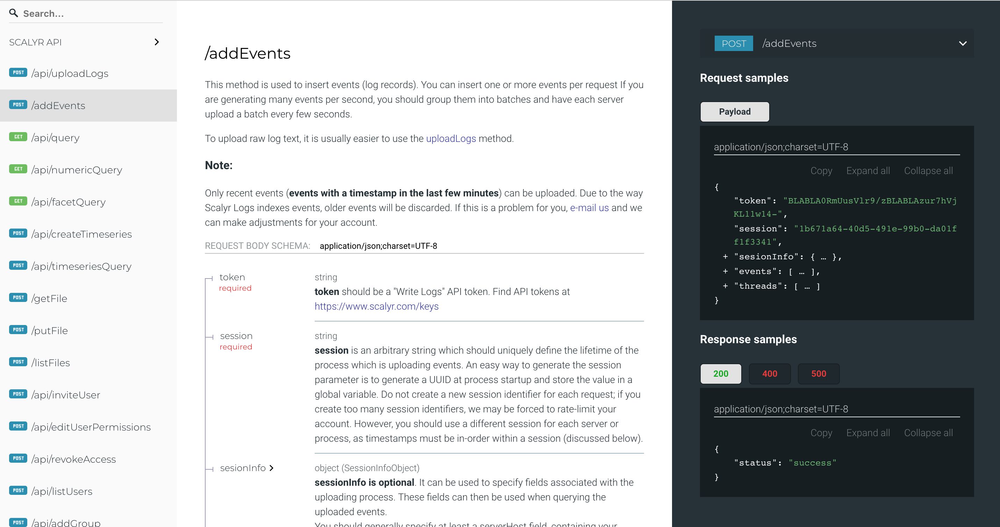

# Scalyr-oas3
This project contains:

1.  A direct port of [Scalyr.com API](https://www.scalyr.com/help/api) endpoints to [OpenAPI 3.0 spec](https://github.com/OAI/OpenAPI-Specification) (OAS3.0). 
2. This also contains a beautiful documentation that was auto generated from the OAS3.0 spec.

## Notes:
1. This is valid as of July 11th 2018. 
2. If you notice any changes after this date, please send a pull request by simply editing the **oas3.yaml**.
3. You can regenerate the documentation using [Redoc CLI](https://github.com/Rebilly/ReDoc/blob/master/cli/README.md) using `redoc-cli bundle ./oas.yaml`

## License
MIT
